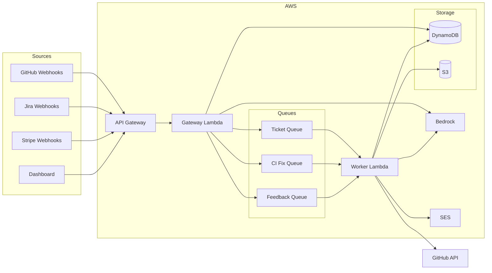

# Coderhelm

**AI coding agent that turns GitHub issues and Jira tickets into pull requests.**

Coderhelm is a serverless platform that listens for issue events from GitHub and Jira, triages the ticket, generates an implementation plan, writes the code, self-reviews the changes, and opens a draft pull request — all without human intervention. It runs entirely on AWS Lambda with Rust services, uses Amazon Bedrock for LLM inference, and integrates with Stripe for usage-based billing.

---

## Architecture

### System Diagram



### Components

| Component | Path | Tech Stack | Purpose |
|-----------|------|------------|--------|
| Gateway | `services/gateway/` | Rust, Axum, Lambda | HTTP API — webhook ingestion, auth, dashboard API, billing routes. Validates signatures, enqueues work to SQS. |
| Worker | `services/worker/` | Rust, Lambda, Bedrock | Async job processor — consumes SQS messages, runs multi-pass AI pipeline, creates PRs via GitHub API. |
| Infrastructure | `infra/` | TypeScript, AWS CDK v2 | IaC — defines all stacks: API, Worker, Database, Storage, Email, Billing, Monitoring, Frontend. |
| Jira Forge App | `coderhelm-jira/` | Node.js, Atlassian Forge | Jira integration — triggers on issue assignment, forwards events to the Gateway webhook endpoint. |
| Dashboard | `infra/lib/frontend-stack.ts` | CloudFront, S3 | SPA frontend served via CloudFront at `app.coderhelm.com`. |
| CI/CD | `.github/workflows/` | GitHub Actions | CI: fmt, clippy, test, CDK synth. Deploy: cargo-zigbuild for ARM64, CDK deploy to production. |

### Data Flow

1. **Webhook received** — A GitHub issue event, Jira issue assignment, or Jira automation rule sends a POST request to the API Gateway endpoint (`/webhooks/github` or `/webhooks/jira`).
2. **Gateway validates** — The Gateway Lambda verifies the webhook signature (HMAC-SHA256 for GitHub, shared secret for Jira), loads the tenant record from DynamoDB, and checks subscription status.
3. **Message enqueued** — The Gateway serializes the ticket into a `TicketMessage` and sends it to the SQS Ticket Queue. CI fix and feedback events go to their dedicated queues.
4. **Worker picks up** — The Worker Lambda is triggered by SQS (batch size 1, max concurrency 10 for tickets). It initializes a GitHub client using the tenant's installation credentials.
5. **Multi-pass pipeline** — The worker runs the ticket through the pass pipeline (see below), calling Amazon Bedrock for each AI step.
6. **PR created** — After all passes complete, the worker pushes a branch to GitHub and opens a draft pull request. A status comment is posted on the original issue.
7. **CI fix loop** — If CI checks fail on the PR, GitHub sends a check-run webhook. The Gateway enqueues a CI fix message, and the worker applies corrections on the same branch.
8. **Feedback loop** — PR review comments trigger the feedback queue. The worker reads the review, applies changes, and pushes follow-up commits.
9. **Notifications** — On completion or failure, the worker sends email notifications via SES using templated emails.

### Worker Pass Pipeline

The main ticket pipeline runs these passes sequentially:

| Pass | Module | Description |
|------|--------|-------------|
| **Triage** | `passes/triage.rs` | Analyzes the issue, determines scope, and extracts requirements. |
| **Plan** | `passes/plan.rs` | Generates a step-by-step implementation plan with file-level changes. |
| **Implement** | `passes/implement.rs` | Writes code changes on a feature branch, applying must-rules. |
| **Review** | `passes/review.rs` | Self-reviews the diff for correctness, style, and rule compliance. |
| **PR** | `passes/pr.rs` | Creates the pull request with a structured description and voice settings. |

Auxiliary flows (triggered by separate SQS queues or message types):

| Flow | Module | Description |
|------|--------|-------------|
| CI Fix | `passes/ci_fix.rs` | Reads CI failure logs and pushes corrective commits. |
| Feedback | `passes/feedback.rs` | Processes PR review comments and applies requested changes. |
| Onboard | `passes/onboard.rs` | Runs initial repository analysis when a new installation is added. |
| Plan Execute | `passes/plan_execute.rs` | Executes approved multi-task plans created from the dashboard. |
| Infra Analyze | `passes/infra_analyze.rs` | Analyzes repository infrastructure and tech stack. |

---

## Repository Structure

<details>
<summary>Click to expand directory tree</summary>

```
.
├── .github/workflows/       # CI and deploy pipelines
│   ├── ci.yml               # Lint, test, CDK synth on push/PR
│   └── deploy.yml           # Build ARM64 binaries, CDK deploy to prod
├── coderhelm-jira/          # Atlassian Forge app for Jira integration
│   ├── manifest.yml         # Forge app manifest (triggers, permissions)
│   ├── src/
│   │   ├── index.js         # Issue event handler — forwards to Gateway
│   │   └── admin.js         # Admin page resolver (settings UI)
│   └── resources/admin/     # Admin page frontend (Vite + React)
├── docs/
│   └── jira-integration.md  # Jira webhook integration guide
├── infra/                   # AWS CDK infrastructure-as-code
│   ├── bin/coderhelm.ts     # CDK app entry — wires all stacks together
│   └── lib/
│       ├── api-stack.ts     # API Gateway, Gateway Lambda, SQS queues
│       ├── worker-stack.ts  # Worker Lambda, SQS event sources
│       ├── database-stack.ts# DynamoDB tables (main, runs, analytics)
│       ├── storage-stack.ts # S3 data bucket (run artifacts)
│       ├── email-stack.ts   # SES identity, templates, permissions
│       ├── billing-stack.ts # Invoice S3 bucket
│       ├── monitoring-stack.ts # CloudWatch alarms, dashboard, SNS alerts
│       └── frontend-stack.ts# CloudFront + S3 for dashboard SPA
├── scripts/
│   └── setup-stripe.sh     # Idempotent Stripe product/price setup
├── services/                # Rust workspace (gateway + worker)
│   ├── Cargo.toml           # Workspace manifest with shared release profile
│   ├── gateway/             # Gateway Lambda service
│   │   └── src/
│   │       ├── main.rs      # Axum router, Lambda HTTP adapter
│   │       ├── routes/      # Webhook, auth, API, billing, plan routes
│   │       ├── auth/        # GitHub App auth, JWT, signature verification
│   │       ├── middleware/   # Auth middleware (JWT tenant scoping)
│   │       ├── clients/     # Shared HTTP/SDK clients
│   │       └── models.rs    # Config, secrets, request/response types
│   └── worker/              # Worker Lambda service
│       └── src/
│           ├── main.rs      # SQS event handler, message dispatch
│           ├── passes/      # AI pipeline passes (triage → plan → implement → review → pr)
│           ├── agent/       # LLM abstraction (Bedrock Converse API)
│           ├── clients/     # GitHub, billing, email clients
│           └── models.rs    # Worker messages, config, token usage
├── SETUP.md                 # Environment setup and deployment guide
└── README.md                # This file
```

</details>

---

## Docs

- **[Setup Guide](SETUP.md)** — Prerequisites, secrets configuration, deployment, and GitHub App registration
- **[Jira Integration](docs/jira-integration.md)** — Quickstart for connecting Jira to Coderhelm via webhooks or automation rules

**Getting Started**: Install the GitHub App, configure secrets in AWS Secrets Manager, and deploy with `cdk deploy --all`. See [SETUP.md](SETUP.md) for the full walkthrough.
